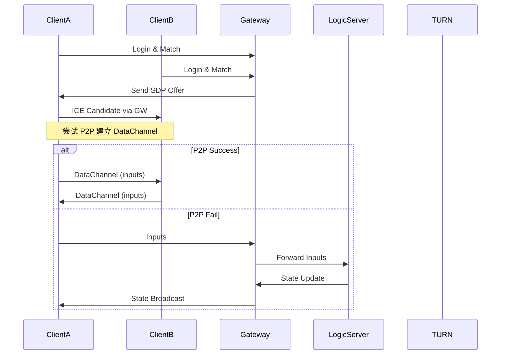

# 实时游戏服务器 — 梳理与合并（整理版）

> **目的**：将原始文档内容系统化、合并相近条目、重新编号并补齐目录与索引，便于开发、评审与运维。文末列出我发现的遗漏与补充建议。

---

## 1. 项目概述

本项目目标构建一个**混合通信模型**的实时游戏服务器，适用于低延迟、高并发的多人对战场景。关键思想：**服务器权威 + P2P（WebRTC DataChannel）加速**，并在 P2P 失败时通过服务器中转（fallback）。

主要组件：
- **MINA**：负责登录、匹配、RPC、WebRTC 信令（Gateway）。
- **WebRTC DataChannel**：用于 P2P 高频操作（移动、输入）。
- **Logic Server**：负责游戏规则、战斗计算、校验。
- **DataLayer**：Redis（缓存/实时状态）+ MySQL（持久化）。
- **TURN/STUN**：Coturn 等，用于 NAT 穿透。

---

## 2. 目标与需求

### 2.1 系统目标
- 低延迟：P2P 成功时端到端 ≤ 80ms；公网目标 <200ms。
- 高并发：单服支持 3k–10k 连接，单服数千房间。
- 可扩展：支持横向拆分网关/逻辑/房间。
- 高可用：支持断线重连、状态恢复。
- 安全：反作弊、消息校验、DDoS 防护。

### 2.2 核心需求（编号）
- **REQ-01**：客户端通过 TCP (MINA) 连接服务器，完成登录、匹配（高）。
- **REQ-02**：匹配成功后服务器协调客户端建立 WebRTC DataChannel（高）。
- **REQ-03**：WebRTC 建立失败时自动 fallback 到 MINA 中转（中）。
- **REQ-04**：高频操作（移动、输入）通过 DataChannel 传输（高）。
- **REQ-05**：关键操作（技能、结算）通过 RPC 到服务器校验（高）。
- **REQ-06**：服务器对关键状态进行校验，防作弊（高）。
- **REQ-07**：支持断线重连并恢复游戏状态（中）。
- **REQ-08**：提供基于 MINA 的 WebRTC 信令服务器（高）。

---

## 3. 整体架构（文字与图）

### 3.1 文本架构图

```
+---------------------+
|     Game Client     |  ←→  TCP/UDP
+----------+----------+
           |
           | (TCP 连接)
           v
+---------------------+
|   Gateway Server    |  ← Apache MINA (NIO)
|  (网络接入层)        |
|  - 连接管理          |
|  - 心跳检测          |
|  - 消息编解码        |
|  - 会话绑定          |
+----------+----------+
           |
           | (内部 RPC / 消息队列)
           v
+---------------------+
|   Logic Server      |  ← 业务逻辑层
|  (游戏逻辑服)        |
|  - 房间/地图管理     |
|  - 状态同步          |
|  - 战斗计算          |
|  - 广播分发          |
+----------+----------+
           |
           v
+---------------------+
|   Data Layer        |
|  - Redis (缓存)      |
|  - MySQL (持久化)    |
+---------------------+
```

### 3.2 说明
- 初期可合并 Gateway + Logic 为单进程以简化部署，后期拆分成网关与逻辑服。
- P2P 建立通过 MINA 转发 SDP/ICE（信令），成功后 DataChannel 承担高频数据。失败时由服务器中转 DataChannel 消息。

---

## 4. 模块划分与职责

| 模块 | 技术栈 | 职责 |
|---|---:|---|
| MINA Gateway | Apache MINA | TCP 会话管理、信令转发、心跳、编解码 |
| Signaling Handler | MINA + JSON | 处理 SDP offer/answer、ICE candidate |
| Matchmaking | Java + Redis | 匹配队列与分配 |
| WebRTC Coordinator | org.webrtc / Java | 生成并转发信令、协调 P2P |
| TURN/STUN | Coturn（外部） | NAT 穿透支持 |
| Logic Server | Java | 房间/地图管理、战斗、校验 |
| DataChannel Proxy | Netty/MINA | P2P 失败的中转 |
| Data Layer | Redis / MySQL | 在线状态缓存 / 持久化 |

---

## 5. 编码规范与工程约定

### 5.1 命名规范
- 类名：大驼峰（如 `RoomManager`）
- 方法名：小驼峰，动词优先（如 `handleMessage()`）
- 常量：全大写 + 下划线（如 `MAX_PLAYERS_PER_ROOM`）
- 包名：小写按功能分层（如 `com.game.server.gateway`）
- 变量：小驼峰，语义清晰（如 `playerSession`）

### 5.2 注释规范
- 类注释：职责、线程安全说明、作者
- 方法注释：使用 Javadoc（参数、返回、异常）
- 行内注释：仅用于复杂逻辑

示例：
```java
/**
 * MINA 消息处理器，负责分发 RPC 与信令。
 * 线程安全：所有方法由 MINA I/O 线程调用，业务逻辑需异步提交。
 */
public class GameIoHandler extends IoHandlerAdapter { ... }
```

### 5.3 异常处理
- 自定义异常继承 `RuntimeException`，带 errorCode。
- 不吞异常，必须记录日志并做兜底动作（如关闭 session）。

示例：
```java
try {
  // ...
} catch (Exception e) {
  log.error("Failed to process move for player {}", playerId, e);
  session.closeNow();
}
```

---

## 6. 线程与资源管理

### 6.1 线程模型
- MINA I/O 线程仅负责网络读写 **禁止阻塞/执行业务逻辑**。
- 业务逻辑应提交到专用业务线程池。

示例：
```java
businessExecutor.execute(() -> {
  logicService.processMove(session, request);
});
```

### 6.2 共享状态与并发容器
- 使用 `ConcurrentHashMap`、`CopyOnWriteArrayList` 或显式锁管理共享状态。

### 6.3 资源回收
- 监听 `sessionClosed` 事件，做房间/会话清理。

---

## 7. 通信协议设计

### 7.1 MINA RPC（二进制 / Protobuf）


```protobuf

syntax = "proto3";
package game;

// RPC 请求/响应

message RpcRequest {
  int32 method_id = 1;
  bytes payload = 2;
}

message RpcResponse {
  bool success = 1;
  bytes result = 2;
}

  

// 玩家输入

message PlayerInput {
  string playerId = 1;
  int32 seq = 2;
  float dx = 3;
  float dy = 4;
  int64 ts = 5;
}

  

// 房间状态

message RoomState {
  string roomId = 1;
  repeated PlayerInput inputs = 2;

}

// 服务端广播

message ServerUpdate {
  int64 tick = 1;
  RoomState state = 2;

}

```

  
### 7.2 WebRTC 信令（JSON over MINA）
示例：
```json
{ "type": "offer", "sdp": "...", "roomId": "room123", "from": "playerA" }
```

### 7.3 DataChannel 消息（简化二进制）
格式：`[1B: msgType][N: payload]`
- `1`：PlayerInput
- `2`：Ping

### 7.4 消息大小与频率限制
- 单条消息 ≤ 1KB
- 输入频率限制：单客户端 ≤ 30 次/秒（反作弊阈值）

---

## 8. 数据架构（Redis + MySQL）

### 8.1 Redis Key 命名规范
```
{game}:{module}:{id}[:sub]
示例：
game:player:1001
game:room:battle:room123
game:session:abc123
```

### 8.2 核心 Redis 结构
| Key | 类型 | 说明 |
|---|---:|---|
| `game:player:{playerId}` | Hash | 玩家在线状态（x,y,roomId等） |
| `game:room:players:{roomId}` | Set | 房间玩家列表 |
| `game:match:queue:{mode}` | List | 匹配队列 |
| `game:session:{token}` | String | 会话令牌映射 |
| `game:leaderboard:{mode}` | ZSet | 排行榜 |

### 8.3 Redis 字段示例
```bash
HSET game:player:1001 playerId "1001" name "Alice" level 10 x 100.5 y 200.3 roomId "room123" lastActive 1712345678
```

### 8.4 MySQL — 核心表（DDL 摘要）
包含数据库：`game_account`, `game_player`, `game_battle`, `game_config`。

**user 表示例**：
```sql
CREATE TABLE `user` (
  `user_id` BIGINT UNSIGNED NOT NULL AUTO_INCREMENT,
  `username` VARCHAR(32) NOT NULL UNIQUE,
  `password_hash` CHAR(64) NOT NULL,
  `email` VARCHAR(100),
  `created_at` DATETIME NOT NULL DEFAULT CURRENT_TIMESTAMP,
  PRIMARY KEY (`user_id`)
) ENGINE=InnoDB DEFAULT CHARSET=utf8mb4;
```

**player 表示例**：
```sql
CREATE TABLE `player` (
  `player_id` BIGINT UNSIGNED NOT NULL,
  `name` VARCHAR(32) NOT NULL,
  `level` INT NOT NULL DEFAULT 1,
  `gold` INT NOT NULL DEFAULT 0,
  `created_at` DATETIME NOT NULL DEFAULT CURRENT_TIMESTAMP,
  PRIMARY KEY (`player_id`)
) ENGINE=InnoDB DEFAULT CHARSET=utf8mb4;
```

**match_record / player_performance / audit_log** 等表结构请参考已有模板（文档中已包含 DDL 示例）。

### 8.5 数据同步策略
- **Redis → MySQL**：玩家下线（同步写）、定时批量（每5分钟异步写）、关键操作（同步写）。
- **MySQL → Redis**：玩家登录时加载基础数据；房间创建加载配置。

---

## 9. 核心功能实现建议

### 9.1 心跳与断线检测
- 客户端每 10s 心跳。服务器使用 `session.getIdleTime()` 检测（30s 无活动断开）。

### 9.2 会话管理
- 使用 `ConcurrentHashMap<Long, IoSession>` 存储 playerId ↔ session 关系。
- 登录绑定：`session.setAttribute("playerId", id)`。

### 9.3 广播策略
- 场景级广播：合并写入，批量 `session.write()`，使用 `WriteFuture` 监听发送结果。

示例：
```java
for (IoSession s : roomSessions) {
  s.write(message);
}
```

### 9.4 状态同步策略
- **状态同步（服务器权威）**：客户端只发操作，服务器广播状态（适合 MOBA）。
- **帧同步**：所有客户端执行相同逻辑（适合 RTS，需严格帧序同步）。

---

## 10. 性能优化与扩展策略

### 10.1 性能关键点
- 序列化：使用 Protobuf（比 JSON 快 5–10 倍）。
- 对象复用：使用对象池（Apache Commons Pool），避免循环中新建 byte[]。
- 日志：生产关闭 DEBUG；采用异步日志（Logback AsyncAppender）。

### 10.2 扩展策略
- 单服承载限制：约 5k–10k 连接。后期考虑：房间分服、网关/逻辑分离、使用消息队列（Kafka）或 RPC（gRPC）。

### 10.3 零拷贝与无锁优化
- 使用 MINA 的 `IoBuffer` 或 NIO `ByteBuffer` 做零拷贝。
- 房间内状态采用分段锁或无锁结构（ConcurrentHashMap）。

---

## 11. 安全、反作弊与监控

### 11.1 通信安全  
- 生产环境启用 TLS（MINA 的 `SslFilter`）。
- 信令不携带敏感信息（密码等）。
- DataChannel 不传递关键敏感操作数据（仅移动/输入）。

### 11.2 反作弊要点
- 输入频率限制：≤ 30 次/秒。
- 状态校验：速度/边界/瞬移检测。
- 关键操作审计：技能释放/结算写入 `audit_log`。

### 11.3 防攻击
- 单 IP 连接速率限制（示例：≤ 10 连接/秒），限制消息大小（≤ 1KB）。

### 11.4 监控与告警
- 指标：连接数、RPC 延迟、P2P 失败率、内存使用。
- 工具：Prometheus + Grafana；Micrometer + JMX Exporter。
- 告警阈值示例：P99 RPC 延迟 > 100ms；连接数 > 90% 最大；内存 > 80%。

---

## 12. 运维与部署规范

### 12.1 环境要求
- OS：Linux（CentOS7+/Ubuntu20.04+）
- JDK：OpenJDK 11+
- 内存：≥4GB（单服）
- 网络：公网 IP + 必要端口（示例：9090 TCP, 3478 UDP/TCP）

### 12.2 依赖服务
- Coturn（STUN/TURN）、Redis Cluster、MySQL（主从）、监控堆栈。

### 12.3 启动脚本示例（start.sh）
```bash
#!/bin/bash
APP_NAME="game-server"
JAR_FILE="game-server-1.0.jar"
LOG_DIR="/var/log/game-server"
PID_FILE="/var/run/${APP_NAME}.pid"

mkdir -p $LOG_DIR

nohup java -Xms2g -Xmx2g \
  -Dspring.profiles.active=prod \
  -jar $JAR_FILE \
  > $LOG_DIR/app.log 2>&1 &

echo $! > $PID_FILE

echo "Started $APP_NAME with PID $(cat $PID_FILE)"
```

### 12.4 备份策略
- MySQL：每日全量 + binlog 实时（保留 30 天）。
- Redis：RDB 每小时 + AOF（保留 7 天）。

### 12.5 Runbook（运维手册）

**故障恢复步骤**：

1. 检查日志 `/var/log/game-server/app.log` 是否有异常堆栈。
2. 确认 Redis/MySQL 是否存活（`systemctl status`）。
3. 尝试重启服务：`systemctl restart game-server`。
4. 若房间数据异常，执行 Redis → MySQL 同步脚本恢复。

**常见问题排查**：

- **连接不上**：检查 9090 TCP 与 3478 UDP 是否开放。
    
- **延迟过高**：检查 NAT 穿透率、TURN 服务器带宽。
    
- **内存泄漏**：启用 `jmap` 分析对象堆快照。
    

---

---

## 13. 测试策略

### 13.1 安全测试计划

- **DDoS 压测**：使用 locust / ab 模拟 1w QPS 短时攻击。
- **渗透测试**：检查常见漏洞（SQL 注入、RCE、弱口令）。
- **Fuzz 测试**：随机数据包输入，确保不会导致崩溃。

| 层级 | 工具 | 目标 |
|---|---:|---|
| 单元测试 | JUnit5 + Mockito | ≥80% 覆盖 |
| 集成测试 | Testcontainers + MINA | 验证信令/ RPC |
| 压力测试 | JMeter / 自研 | 模拟 5k 并发 |
| P2P 测试 | 浏览器 + Coturn | NAT 穿透率评估 |

示例单元测试：`RoomManagerTest`。

---

## 14. 版本控制与发布流程

### 14.1 分支策略
- `main`：生产
- `develop`：开发主干
- `feature/*`：功能分支
- `release/*`：发布分支

### 14.2 发布流程
1. Pull Request + 代码审查
2. CI 自动化测试
3. 打包：`mvn clean package -Pprod`
4. 灰度（部署到单台）→ 30 分钟监控稳定 → 全量发布

### 14.3 CI/CD Pipeline 示例

**Jenkinsfile**

```groovy

pipeline {
  agent any
  stages {
    stage('Build') {
      steps { sh 'mvn clean package -DskipTests' }
    }

    stage('Test') {
      steps { sh 'mvn test' }
    }

    stage('Docker Build') {
      steps { sh 'docker build -t game-server:${BUILD_NUMBER} .' }
    }
    stage('Deploy') {
      steps { sh './scripts/deploy.sh' }
    }
  }
}

```

  

**GitHub Actions**

```yaml

name: CI/CD

on: [push]

jobs:

  build:

    runs-on: ubuntu-latest

    steps:

      - uses: actions/checkout@v3

      - name: Setup JDK 11

        uses: actions/setup-java@v3

        with:

          java-version: '11'

      - name: Build

        run: mvn clean package -DskipTests

      - name: Test

        run: mvn test

```

---

## 15. 风险与应对

| 风险 | 对应方案 |
|---|---|
| NAT 穿透失败率高 | 部署 TURN，增加中继能力 |
| P2P 消息不可信 | 关键逻辑走服务器校验，审计日志回放 |
| 客户端实现复杂 | 提供客户端 SDK，抽象细节 |
| 维护两套消息路径 | 统一 `MessageRouter` 接口，隐藏实现 |

---

## 16. 优化要点摘录（快速清单）
1. 对象复用（ObjectPool）
2. 批量广播（减少系统调用）
3. 零拷贝（IoBuffer/ByteBuffer）
4. 背压控制（客户端限速）
5. 使用异步日志与监控埋点

---

## 17. 附录：重要示例（摘要）
- **Protobuf 示例**、**Redis 字段示例**、**MySQL DDL**、**start.sh**、**RoomManagerTest** 均已合并到对应章节，具体完整代码在源码 `docs/` 目录下存放。
### 17.1 客户端 SDK 示例

  

**浏览器 (JavaScript + WebRTC)**

```javascript

const pc = new RTCPeerConnection();

const dc = pc.createDataChannel("game");

dc.onmessage = (e) => console.log("server update", e.data);

dc.send(JSON.stringify({type: "move", dx: 1, dy: 0}));

```

  

**Unity (C#)**

```csharp

using Unity.WebRTC;

var pc = new RTCPeerConnection();

var dc = pc.CreateDataChannel("game");

dc.OnMessage = bytes => Debug.Log("Update: " + Encoding.UTF8.GetString(bytes));

```

  

**移动端 (Kotlin/Android)**

```kotlin

val pc = PeerConnectionFactory().createPeerConnection(config, observer)!!

val dc = pc.createDataChannel("game", DataChannel.Init())

dc.registerObserver(object: DataChannel.Observer {

  override fun onMessage(buffer: DataChannel.Buffer) {

    Log.d("GameUpdate", buffer.toString())

  }

})

```
---

## 18. 补充章节

  

### 18.1 容量规划表（估算）

| 并发玩家数 | CPU (核) | 内存 (GB) | 带宽 (Mbps) |

|---|---|---|---|

| 1k | 2 | 4 | 50 |

| 5k | 4 | 8 | 200 |

| 10k | 8 | 16 | 500 |

  

### 18.2 日志与审计保留策略

- 应用日志：7 天热存储 → 30 天冷存储

- 审计日志：90 天 → 归档存储（合规要求）

- MySQL binlog：30 天

- Redis AOF/RDB：7 天

  

### 18.3 分库分表实现示例

```sql

-- 分表规则：按 playerId % 16 拆分

CREATE TABLE player_00 (...);

CREATE TABLE player_01 (...);

-- 查询示例

SELECT * FROM player_${playerId % 16} WHERE player_id = ?;

```

  

### 18.4 端到端序列图（Mermaid）



  

---

