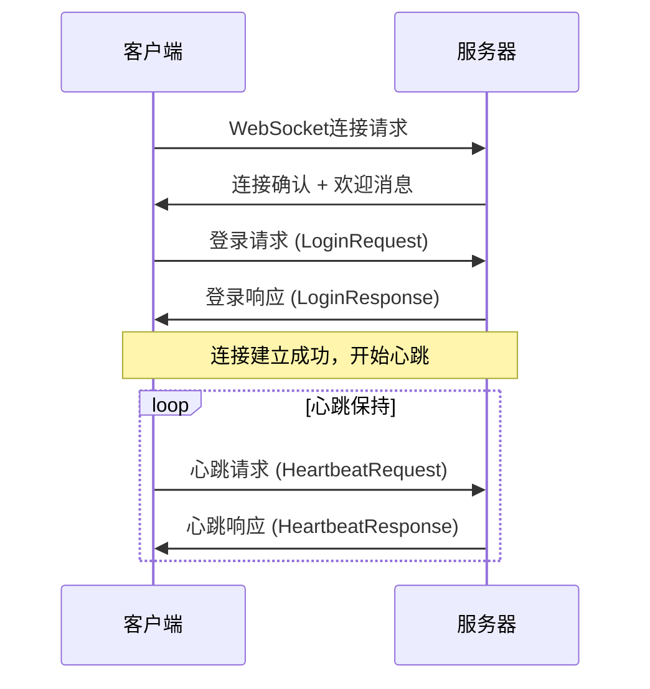
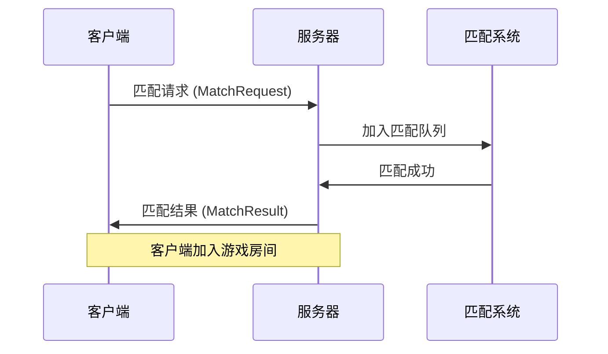

# LuminaServer 客户端通信协议文档

## 1. 概述

LuminaServer 是一个基于 WebSocket 和自定义二进制协议的实时多人游戏服务器。本文档详细说明了客户端如何连接服务器、传输协议格式、通信规则以及相关的API接口。

### 1.1 技术栈
- **主要协议**: WebSocket (实时通信)
- **HTTP API**: RESTful API (基础操作)
- **消息格式**: Protocol Buffers (protobuf)
- **传输层**: TCP/IP
- **WebRTC**: 音视频通信支持

### 1.2 服务器配置
- **HTTP 端口**: 8088
- **WebSocket 端口**: 9090
- **最大连接数**: 10,000
- **心跳间隔**: 10秒
- **空闲超时**: 30秒

---

## 2. 连接方式

### 2.1 WebSocket 连接

#### 2.1.1 连接地址
```
ws://[服务器IP]:9090/game
```

#### 2.1.2 连接示例 (JavaScript)
```javascript
const socket = new WebSocket('ws://localhost:9090/game');

socket.onopen = function(event) {
    console.log('WebSocket连接已建立');
    // 发送登录请求
    sendLoginRequest();
};

socket.onmessage = function(event) {
    // 处理服务器消息
    handleServerMessage(event.data);
};

socket.onclose = function(event) {
    console.log('WebSocket连接已关闭', event.code, event.reason);
};

socket.onerror = function(error) {
    console.error('WebSocket错误:', error);
};
```

#### 2.1.3 连接示例 (Java)
```java
import org.java_websocket.client.WebSocketClient;
import org.java_websocket.handshake.ServerHandshake;

WebSocketClient client = new WebSocketClient(new URI("ws://localhost:9090/game")) {
    @Override
    public void onOpen(ServerHandshake handshake) {
        System.out.println("WebSocket连接已建立");
        // 发送登录请求
        sendLoginRequest();
    }
    
    @Override
    public void onMessage(String message) {
        // 处理服务器消息
        handleServerMessage(message);
    }
    
    @Override
    public void onClose(int code, String reason, boolean remote) {
        System.out.println("WebSocket连接已关闭: " + code + " " + reason);
    }
    
    @Override
    public void onError(Exception ex) {
        ex.printStackTrace();
    }
};

client.connect();
```

### 2.2 HTTP API 连接

#### 2.2.1 基础地址
```
http://[服务器IP]:8088/api
```

#### 2.2.2 健康检查
```http
GET /health
```

---

## 3. 消息协议格式

### 3.1 Protocol Buffers 定义

服务器使用 Protocol Buffers 作为消息序列化格式。主要消息类型定义在 `game.proto` 文件中。

#### 3.1.1 基础消息结构

```protobuf
// RPC 请求
message RpcRequest {
  int32 method_id = 1;        // 方法ID
  bytes payload = 2;          // 消息载荷
  int64 timestamp = 3;        // 时间戳
  string trace_id = 4;        // 追踪ID
}

// RPC 响应
message RpcResponse {
  bool success = 1;           // 是否成功
  bytes result = 2;           // 结果数据
  string error_code = 3;      // 错误码
  string error_message = 4;   // 错误信息
  int64 timestamp = 5;        // 时间戳
}
```

#### 3.1.2 消息类型ID定义

| 消息类型 | Method ID | 描述 |
|---------|-----------|------|
| LOGIN_REQUEST | 1001 | 登录请求 |
| LOGIN_RESPONSE | 1002 | 登录响应 |
| HEARTBEAT_REQUEST | 1003 | 心跳请求 |
| HEARTBEAT_RESPONSE | 1004 | 心跳响应 |
| MATCH_REQUEST | 2001 | 匹配请求 |
| MATCH_RESPONSE | 2002 | 匹配响应 |
| MATCH_RESULT | 2003 | 匹配结果 |
| PLAYER_INPUT | 3001 | 玩家输入 |
| SERVER_UPDATE | 3002 | 服务器更新 |
| SIGNALING_MESSAGE | 4001 | WebRTC信令 |

### 3.2 消息编码格式

#### 3.2.1 二进制消息格式
```
[消息长度(4字节)] + [消息类型ID(4字节)] + [Protobuf数据]
```

#### 3.2.2 文本消息格式 (JSON)
```json
{
  "messageType": "LOGIN_REQUEST",
  "timestamp": 1640995200000,
  "data": {
    "username": "player1",
    "token": "auth_token_here",
    "clientVersion": "1.0.0"
  }
}
```

---

## 4. 通信流程

### 4.1 连接建立流程



### 4.2 游戏匹配流程



---

## 5. 主要消息类型详解

### 5.1 登录消息

#### 5.1.1 登录请求 (LoginRequest)
```protobuf
message LoginRequest {
  string username = 1;        // 用户名
  string token = 2;           // 认证令牌
  string client_version = 3;  // 客户端版本
}
```

#### 5.1.2 登录响应 (LoginResponse)
```protobuf
message LoginResponse {
  bool success = 1;           // 登录是否成功
  string player_id = 2;       // 玩家ID
  string session_id = 3;      // 会话ID
  string error_message = 4;   // 错误信息
}
```

### 5.2 心跳消息

#### 5.2.1 心跳请求 (HeartbeatRequest)
```protobuf
message HeartbeatRequest {
  string player_id = 1;       // 玩家ID
  int64 timestamp = 2;        // 客户端时间戳
}
```

#### 5.2.2 心跳响应 (HeartbeatResponse)
```protobuf
message HeartbeatResponse {
  int64 server_timestamp = 1; // 服务器时间戳
  int32 ping = 2;             // 延迟(毫秒)
}
```

### 5.3 游戏输入消息

#### 5.3.1 玩家输入 (PlayerInput)
```protobuf
message PlayerInput {
  string player_id = 1;       // 玩家ID
  int32 seq = 2;              // 序列号
  float dx = 3;               // X轴移动
  float dy = 4;               // Y轴移动
  int32 action_type = 5;      // 动作类型
  int64 timestamp = 6;        // 时间戳
}
```

### 5.4 WebRTC 信令消息

#### 5.4.1 信令消息 (SignalingMessage)
```protobuf
message SignalingMessage {
  string type = 1;            // 信令类型 (offer/answer/ice-candidate)
  string from_player = 2;     // 发送者
  string to_player = 3;       // 接收者
  string room_id = 4;         // 房间ID
  string sdp = 5;             // SDP数据
  string candidate = 6;       // ICE候选
  int64 timestamp = 7;        // 时间戳
}
```

---

## 6. 错误处理

### 6.1 错误码定义

| 错误码 | 描述 | 处理建议 |
|--------|------|----------|
| 1001 | 认证失败 | 重新登录 |
| 1002 | 会话过期 | 重新建立连接 |
| 2001 | 房间已满 | 等待或选择其他房间 |
| 2002 | 房间不存在 | 刷新房间列表 |
| 3001 | 消息格式错误 | 检查消息格式 |
| 3002 | 消息过大 | 减少消息大小 |
| 4001 | 服务器内部错误 | 稍后重试 |

### 6.2 连接异常处理

#### 6.2.1 连接断开重连机制
```javascript
class GameClient {
    constructor(serverUrl) {
        this.serverUrl = serverUrl;
        this.reconnectAttempts = 0;
        this.maxReconnectAttempts = 5;
        this.reconnectDelay = 1000; // 1秒
    }
    
    connect() {
        this.socket = new WebSocket(this.serverUrl);
        
        this.socket.onclose = (event) => {
            if (this.reconnectAttempts < this.maxReconnectAttempts) {
                setTimeout(() => {
                    this.reconnectAttempts++;
                    console.log(`重连尝试 ${this.reconnectAttempts}/${this.maxReconnectAttempts}`);
                    this.connect();
                }, this.reconnectDelay * this.reconnectAttempts);
            }
        };
        
        this.socket.onopen = () => {
            this.reconnectAttempts = 0; // 重置重连计数
        };
    }
}
```

---

## 7. 性能优化建议

### 7.1 消息发送优化

1. **批量发送**: 将多个小消息合并为一个大消息发送
2. **消息压缩**: 对大消息进行压缩
3. **优先级队列**: 重要消息优先发送

### 7.2 连接管理优化

1. **连接池**: 复用WebSocket连接
2. **心跳优化**: 根据网络状况调整心跳频率
3. **断线重连**: 实现智能重连机制

---

## 8. 安全注意事项

### 8.1 认证安全

1. **Token验证**: 所有请求必须包含有效的认证令牌
2. **会话管理**: 定期刷新会话，防止会话劫持
3. **IP限制**: 限制单个IP的连接数量

### 8.2 消息安全

1. **消息验证**: 验证消息格式和内容
2. **频率限制**: 限制消息发送频率，防止刷屏
3. **内容过滤**: 过滤恶意内容

---

## 9. 调试和监控

### 9.1 日志记录

客户端应记录以下信息：
- 连接建立和断开事件
- 消息发送和接收记录
- 错误和异常信息
- 性能指标（延迟、吞吐量等）

### 9.2 监控指标

- **连接状态**: 连接是否正常
- **消息延迟**: 消息往返时间
- **错误率**: 消息发送失败率
- **重连次数**: 连接重建次数

---

## 10. 示例代码

### 10.1 完整的客户端示例 (JavaScript)

```javascript
class LuminaGameClient {
    constructor(serverUrl) {
        this.serverUrl = serverUrl;
        this.socket = null;
        this.playerId = null;
        this.sessionId = null;
        this.heartbeatInterval = null;
    }
    
    // 连接服务器
    connect() {
        return new Promise((resolve, reject) => {
            this.socket = new WebSocket(this.serverUrl);
            
            this.socket.onopen = () => {
                console.log('连接已建立');
                resolve();
            };
            
            this.socket.onmessage = (event) => {
                this.handleMessage(event.data);
            };
            
            this.socket.onclose = () => {
                console.log('连接已关闭');
                this.stopHeartbeat();
            };
            
            this.socket.onerror = (error) => {
                console.error('连接错误:', error);
                reject(error);
            };
        });
    }
    
    // 登录
    async login(username, token) {
        const loginRequest = {
            messageType: 'LOGIN_REQUEST',
            data: {
                username: username,
                token: token,
                clientVersion: '1.0.0'
            }
        };
        
        this.sendMessage(loginRequest);
    }
    
    // 发送消息
    sendMessage(message) {
        if (this.socket && this.socket.readyState === WebSocket.OPEN) {
            this.socket.send(JSON.stringify(message));
        }
    }
    
    // 处理服务器消息
    handleMessage(data) {
        const message = JSON.parse(data);
        
        switch (message.messageType) {
            case 'LOGIN_RESPONSE':
                this.handleLoginResponse(message.data);
                break;
            case 'HEARTBEAT_RESPONSE':
                this.handleHeartbeatResponse(message.data);
                break;
            case 'MATCH_RESULT':
                this.handleMatchResult(message.data);
                break;
            // 其他消息类型...
        }
    }
    
    // 开始心跳
    startHeartbeat() {
        this.heartbeatInterval = setInterval(() => {
            this.sendMessage({
                messageType: 'HEARTBEAT_REQUEST',
                data: {
                    playerId: this.playerId,
                    timestamp: Date.now()
                }
            });
        }, 10000); // 10秒间隔
    }
    
    // 停止心跳
    stopHeartbeat() {
        if (this.heartbeatInterval) {
            clearInterval(this.heartbeatInterval);
            this.heartbeatInterval = null;
        }
    }
}

// 使用示例
const client = new LuminaGameClient('ws://localhost:9090/game');
client.connect().then(() => {
    client.login('player1', 'auth_token');
});
```

---

## 11. 常见问题解答

### Q1: 如何处理网络断线？
A1: 实现自动重连机制，在连接断开时尝试重新连接，并在重连成功后重新发送必要的状态信息。

### Q2: 消息发送失败怎么办？
A2: 实现消息确认机制，对于重要消息，等待服务器确认后再发送下一条消息。

### Q3: 如何优化游戏延迟？
A3: 使用UDP协议进行游戏数据传输，实现客户端预测和服务器校正机制。

### Q4: 如何处理大量玩家的消息？
A4: 实现消息优先级和批量处理机制，对非关键消息进行合并发送。

---

## 12. 更新日志

- **v1.0.0** (2024-01-20): 初始版本，包含基础通信协议
- **v1.1.0** (待发布): 添加WebRTC音视频通信支持

---

*本文档将随着项目的发展持续更新，请关注最新版本。*